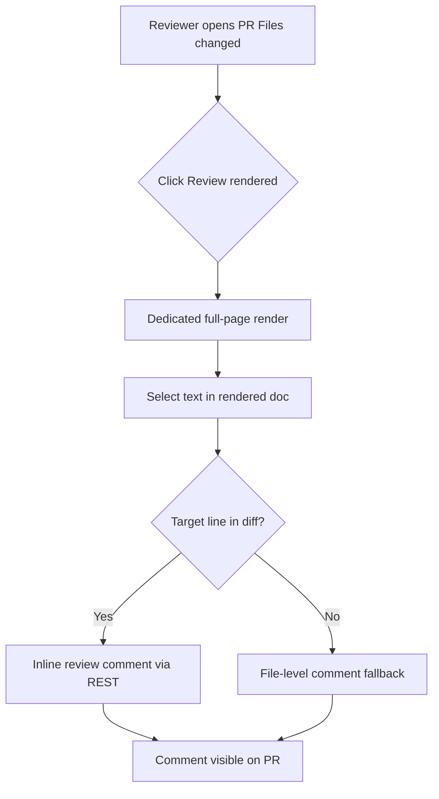
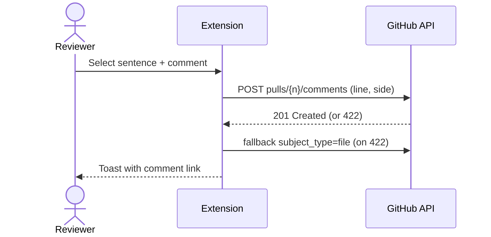

# DraftView Review Demo — Agent Sync Design Brief

> **Status:** Draft · **Author:** Ghost (test) · **Date:** 2026-06-09
> This is a throwaway document created to test rendered-markdown review tooling (DraftView) on a GitHub PR. Safe to delete.

## 1. Background

Our team recently migrated the TDB (Technical Design Brief) platform from Notion to GitHub. The move bought us strong wins — agents read, write, and version documents far more reliably, and authoring sits next to the code it describes. But it cost us **review ergonomics**: GitHub cannot render a markdown file *and* accept inline comments on the rendered view at the same time.

This document is a deliberately varied markdown sample so we can stress-test whether a review tool lets us highlight rendered prose and leave comments that sync back to the pull request.

## 2. Goals

- Comment directly on the **rendered** document, not the raw diff.
- Select arbitrary spans — a word, a sentence, a paragraph — rather than whole lines only.
- Have every comment round-trip back into the PR as a native artifact.

### Non-goals

- Replacing GitHub as the source of truth.
- Changing how agents author documents.

## 3. Proposed Review Layers

| Layer | What it catches | Where it lives |
|-------|-----------------|----------------|
| Mechanical | typos, style, terminology | CI linter |
| Rendered read | layout, tables, diagrams | preview surface |
| Prose edit | sentence-level wording | inline suggestion |
| Consensus | approve / block | reviewers + reactions |

## 4. A Paragraph Worth Commenting On

The quick brown fox jumps over the lazy dog. This sentence exists purely so a reviewer can try highlighting a *single phrase* in the middle of a paragraph and attaching a note to it. If the tool can anchor a comment to "the lazy dog" specifically — and not just to line 42 — then it solves the core complaint.

## 5. Sample Code Block

```go
// trySuggest returns the first successful provider response.
func (s *Suggester) complete(ctx context.Context, q Query) (Response, error) {
    for _, p := range s.providers {
        if resp, err := p.Suggest(ctx, q); err == nil {
            return resp, nil
        }
    }
    return Response{}, errNoProvider
}
```

## 5b. Review Flow (mermaid)





## 6. Open Questions

1. Do rendered comments survive a force-push / rebase of the PR branch?
2. Can non-engineers review without a GitHub account?
3. How are resolved comment threads represented back in the repo?

## 7. Decision

_Pending review feedback collected through this very document._
